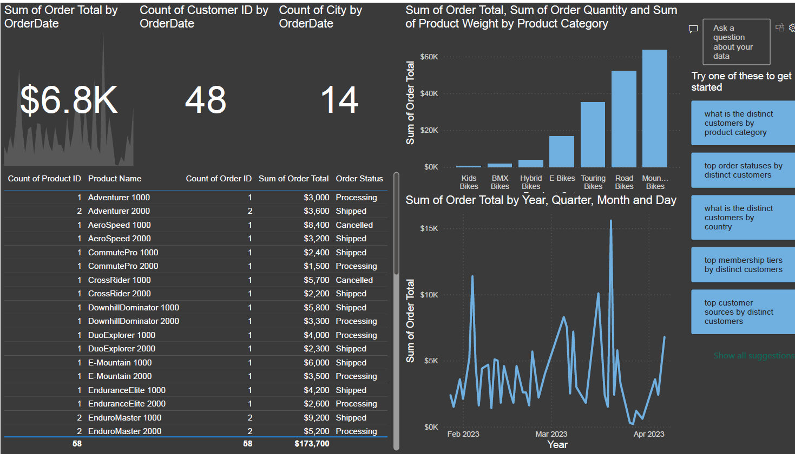

🚀 Executive Dashboard – Power BI Project

This project showcases an interactive and comprehensive Executive Dashboard developed using Power BI for Adventure Works. The goal of this report is to provide clear insights and support data-driven decision-making at the executive level.

📊 Project Overview

Designed interactive data tables and visuals to highlight top-selling products and order status.

Created bar and line charts to analyze monthly product performance and sales trends.

Implemented Key Performance Indicators (KPIs) to monitor core metrics such as total sales, number of customers, and most active cities.

Integrated sales forecasting models to estimate future trends with high accuracy.

Activated Power BI Q&A feature, allowing managers to query data conversationally and obtain instant insights.

🧰 Tools & Technologies

Power BI Desktop

Data Modeling & DAX

Forecasting & Time Series Analysis

Q&A Natural Language Interface

Data Visualization & Dashboard Design

